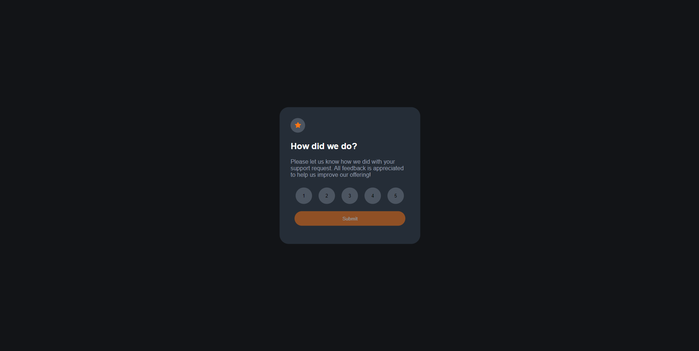

# Interactive Rating Component

## Table of contents

- [Overview](#overview)
- [Screenshot](#screenshot)
- [My process](#my-process)
  - [Built with](#built-with)
  - [What I learned](#what-i-learned)
  - [Useful resources](#useful-resources)

  ## Overview

  This rating component is a simple web application that can be integrated as a part of a larger apllication or website. The app makes it possible to receive user feedback in a professional manner. Application is stylished in dark greyish coloring with orange buttons. Screen will cahnge into a "thank you"- screen when feedback is submited. This project was ment to be re-introduction into HTML5 since I had not used it in a while. It also worked as a reminder into the world of CSS. Some simple JavaScript was also used in the app.

  ## Screenshot

  

  ## My Process

  ### Built with

  - Sematic HTML5 markup
  - CSS
  - JavaScript

  ### What I learned

  I chose this project as a simple re-introduction back into the world of HTML and CSS. It worked as a good reminder of the basics.

  ### Useful resources

  - [Frontend Mentor](https://www.frontendmentor.io/) - Source for great project ideas